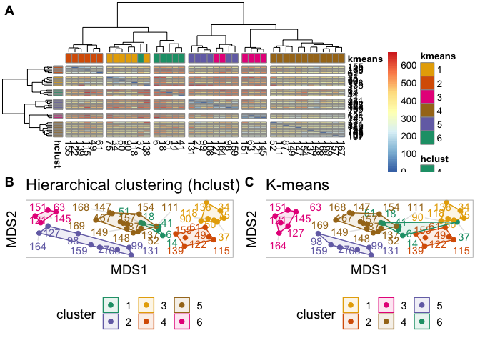
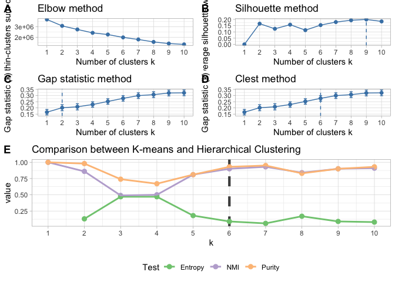
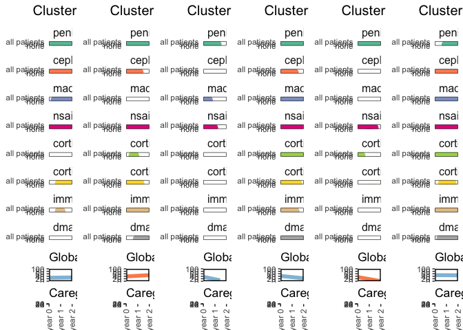
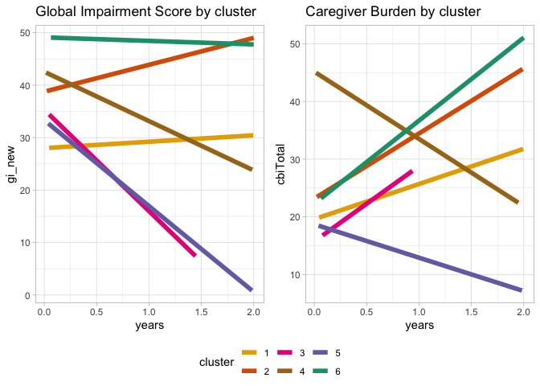

Medication Alignment Algorithm (Medal)
================
Arturo Lopez Pineda
2020-05-17

# Step 0. Load required libraries

``` r
remove(list=ls())

#General
library(tidyverse)
```

    ## ── Attaching packages ────────────────────────────────────────────────────────────────────────── tidyverse 1.3.0 ──

    ## ✓ ggplot2 3.3.0     ✓ purrr   0.3.3
    ## ✓ tibble  3.0.0     ✓ dplyr   0.8.5
    ## ✓ tidyr   1.0.2     ✓ stringr 1.4.0
    ## ✓ readr   1.3.1     ✓ forcats 0.5.0

    ## Warning: package 'tibble' was built under R version 3.6.2

    ## ── Conflicts ───────────────────────────────────────────────────────────────────────────── tidyverse_conflicts() ──
    ## x dplyr::filter() masks stats::filter()
    ## x dplyr::lag()    masks stats::lag()

``` r
library(here)
```

    ## here() starts at /Users/lopezpia/Documents/GitHub/medal

``` r
library(dplyr)
library(knitr)

#Plotting libraries
library(ggplot2)
library(ggpubr)
```

    ## Loading required package: magrittr

    ## 
    ## Attaching package: 'magrittr'

    ## The following object is masked from 'package:purrr':
    ## 
    ##     set_names

    ## The following object is masked from 'package:tidyr':
    ## 
    ##     extract

``` r
library(ggrepel)
library(ggplotify)

#Clustering libraries
library(factoextra)
```

    ## Welcome! Want to learn more? See two factoextra-related books at https://goo.gl/ve3WBa

``` r
library(NbClust)
library(aricode)
library(Rtsne)
library(dendextend)
```

    ## 
    ## ---------------------
    ## Welcome to dendextend version 1.13.4
    ## Type citation('dendextend') for how to cite the package.
    ## 
    ## Type browseVignettes(package = 'dendextend') for the package vignette.
    ## The github page is: https://github.com/talgalili/dendextend/
    ## 
    ## Suggestions and bug-reports can be submitted at: https://github.com/talgalili/dendextend/issues
    ## Or contact: <tal.galili@gmail.com>
    ## 
    ##  To suppress this message use:  suppressPackageStartupMessages(library(dendextend))
    ## ---------------------

    ## 
    ## Attaching package: 'dendextend'

    ## The following object is masked from 'package:ggpubr':
    ## 
    ##     rotate

    ## The following object is masked from 'package:stats':
    ## 
    ##     cutree

``` r
library(NMF) #for cluster purity and entropy
```

    ## Loading required package: pkgmaker

    ## Loading required package: registry

    ## Loading required package: rngtools

    ## Loading required package: cluster

    ## Warning: namespace 'Biobase' is not available and has been replaced
    ## by .GlobalEnv when processing object ''

    ## Warning: namespace 'Biobase' is not available and has been replaced
    ## by .GlobalEnv when processing object ''
    
    ## Warning: namespace 'Biobase' is not available and has been replaced
    ## by .GlobalEnv when processing object ''
    
    ## Warning: namespace 'Biobase' is not available and has been replaced
    ## by .GlobalEnv when processing object ''
    
    ## Warning: namespace 'Biobase' is not available and has been replaced
    ## by .GlobalEnv when processing object ''
    
    ## Warning: namespace 'Biobase' is not available and has been replaced
    ## by .GlobalEnv when processing object ''
    
    ## Warning: namespace 'Biobase' is not available and has been replaced
    ## by .GlobalEnv when processing object ''
    
    ## Warning: namespace 'Biobase' is not available and has been replaced
    ## by .GlobalEnv when processing object ''
    
    ## Warning: namespace 'Biobase' is not available and has been replaced
    ## by .GlobalEnv when processing object ''
    
    ## Warning: namespace 'Biobase' is not available and has been replaced
    ## by .GlobalEnv when processing object ''
    
    ## Warning: namespace 'Biobase' is not available and has been replaced
    ## by .GlobalEnv when processing object ''
    
    ## Warning: namespace 'Biobase' is not available and has been replaced
    ## by .GlobalEnv when processing object ''
    
    ## Warning: namespace 'Biobase' is not available and has been replaced
    ## by .GlobalEnv when processing object ''
    
    ## Warning: namespace 'Biobase' is not available and has been replaced
    ## by .GlobalEnv when processing object ''
    
    ## Warning: namespace 'Biobase' is not available and has been replaced
    ## by .GlobalEnv when processing object ''
    
    ## Warning: namespace 'Biobase' is not available and has been replaced
    ## by .GlobalEnv when processing object ''
    
    ## Warning: namespace 'Biobase' is not available and has been replaced
    ## by .GlobalEnv when processing object ''
    
    ## Warning: namespace 'Biobase' is not available and has been replaced
    ## by .GlobalEnv when processing object ''

    ## NMF - BioConductor layer [NO: missing Biobase] | Shared memory capabilities [NO: bigmemory] | Cores 11/12

    ##   To enable the Bioconductor layer, try: install.extras('
    ## NMF
    ## ') [with Bioconductor repository enabled]
    ##   To enable shared memory capabilities, try: install.extras('
    ## NMF
    ## ')

    ## 
    ## Attaching package: 'NMF'

    ## The following object is masked from 'package:aricode':
    ## 
    ##     entropy

``` r
#Heatmap
library("pheatmap")

#ANOVA
library(lme4)
```

    ## Loading required package: Matrix

    ## 
    ## Attaching package: 'Matrix'

    ## The following objects are masked from 'package:tidyr':
    ## 
    ##     expand, pack, unpack

``` r
library(lmerTest)
```

    ## 
    ## Attaching package: 'lmerTest'

    ## The following object is masked from 'package:lme4':
    ## 
    ##     lmer

    ## The following object is masked from 'package:stats':
    ## 
    ##     step

``` r
#Additional functions
#source(here("programs", "fun-medal.R")) #PyMedal is used instead
source(here("programs", "fun-support.R"))
source(here("programs", "fun-plot.R"))
```

 

# Step 1. Read file

``` r
#---
#File with patient ID (de-ID), comorbidities, initial clinical presentation, etc.
patients.og <- read_csv(here("../data", "patients.csv")) %>%
  column_to_rownames(var="id") 
```

    ## Parsed with column specification:
    ## cols(
    ##   .default = col_double(),
    ##   clinical_history = col_logical(),
    ##   Imaging = col_logical(),
    ##   Medication_History = col_logical(),
    ##   HLA_genotyping = col_logical()
    ## )

    ## See spec(...) for full column specifications.

``` r
#Select only a few columns
patients <- patients.og %>%
  select("age_onset", "age_1st_appt", "is_male", "NHW", "OCD", "foodprob", "anx", 
            "emotional", "mood", "agg", "sch", "reg", "sleep", "tics") %>%
  drop_na()

#---
#File with events
events.og <- read_csv(here("../data", "medications.csv")) 
```

    ## Parsed with column specification:
    ## cols(
    ##   id = col_double(),
    ##   age_1st_appt = col_double(),
    ##   age_onset = col_double(),
    ##   medication = col_character(),
    ##   start = col_double(),
    ##   end = col_double(),
    ##   Duration = col_double(),
    ##   firstAppointment = col_double(),
    ##   Frequency = col_character(),
    ##   last_FU = col_double()
    ## )

``` r
#Select only events related to patients in the previous file
events <- events.og %>%
  filter(id %in% rownames(patients)) %>%
  select("id", "medication", "start", "end")

#---
#File with clinical evaluations (outcomes)
outcomes.og <- read_csv(here("../data","outcomes.csv"))
```

    ## Parsed with column specification:
    ## cols(
    ##   .default = col_double()
    ## )
    ## See spec(...) for full column specifications.

``` r
#Select only rows for the same patients listed in Profiles
outcomes <- outcomes.og %>%
  filter(id %in% rownames(patients)) %>%
  select("id", "gi_new", "cbiTotal", "daysSinceBirth")

#---
#Censoring
years = 2
```

 

# Step 2. Clean Data and Right Censor

``` r
# Group by class of medication
medgroups <- lst(penicillin = c("penicillin v", "penicillin g", "amoxicillin", "augmentin"),
                cephalosporin = c("cephalexin", "cefadroxil"), 
                macrolide = c("azithromycin"),
                nsaid = c("ibuprofen", "naproxen", "indomethacin", "sulindac", "aspirin"),
                corticosteroid.oral = c("prednisone", "maintenance prednisone", "decadron"),
                corticosteroid.iv = c("solumedrol"),
                immunoglobulins = c("ivig"),
                dmard = c("rituximab", "methotrexate", "cellcept"))

medcolors= c("penicillin"="#66c2a5",
             "cephalosporin" = "#fc8d62",
             "macrolide" = "#8da0cb",
             "nsaid" = "#e7298a",
             "corticosteroid.oral" = "#a6d854",
             "corticosteroid.iv" = "#ffd92f",
             "antibody" = "green",
             "immunoglobulins" = "#e5c494",
             "dmard" = "#b3b3b3")


events <- events.og %>%
  cleanEvents(medgroups) %>%
  rightCensoring(years)

write_csv(events, here("../data", "data-matrix-clean.csv"))
```

 

# Step 3. Create a distance matrix

``` r
#-------
#Calling pyMEDAL

pymedal <- here("pymedal", "pymedal.py")
input <- here("../data", "data-matrix-clean.csv")

system(paste('python3', pymedal, input), wait=TRUE)


#Reading the output
distMatrix = read.table("distance_mat.txt")
patientIDs = read.table("patientID.txt", sep=",")

pID = as.vector(unlist(patientIDs))
colnames(distMatrix) = pID
rownames(distMatrix) = pID
```

 

# Step 4. Choose number of clusters

``` r
d = distMatrix

# Elbow method
elbow <- fviz_nbclust(x=d, diss=as.dist(d), hcut, method = "wss") +
  #geom_vline(xintercept = k, linetype = "dashed", color="#5581B0", size=0.6) +
  labs(title = "Elbow method",
       y="Total within-clusters sum of squares") +
  theme_light()

# Silhouette method
silhouette <- fviz_nbclust(x=d, diss=as.dist(d), hcut, method = "silhouette", 
                           print.summary = FALSE, barcolor = "white") +
  #geom_vline(xintercept = 2, linetype = "dashed", color="#5581B0", size=0.6) +
  #geom_vline(xintercept = 4, linetype = "dashed", color="#5581B0", size=0.6) +
  labs(title = "Silhouette method") +
  theme_light()


# Gap statistic
# nboot = 50 to keep the function speedy. 
# recommended value: nboot= 500 for your analysis.
# Use verbose = FALSE to hide computing progression.
set.seed(123)
gapStat <- fviz_nbclust(x=d, diss=as.dist(d), hcut, nstart = 25, 
                        method = "gap_stat", nboot = 50, print.summary = TRUE,
                        maxSE=list(method="Tibs2001SEmax", SE.factor=1)) +
  labs(title = "Gap statistic method") +
  theme_light()

clest <- fviz_nbclust(x=d, diss=as.dist(d), hcut, nstart = 25, 
                        method = "gap_stat", nboot = 50, print.summary = TRUE,
                        maxSE=list(method="globalSEmax", SE.factor=3)) +
  labs(title = "Clest method") +
  theme_light()

numKPanels <- ggarrange(elbow, silhouette, gapStat, clest,
                     labels = c("A", "B", "C", "D"),
                     ncol = 2, nrow = 2, legend="bottom", 
                     align="v", common.legend = FALSE)
ggexport(numKPanels, filename=here("images", "Figure4-b-num-clusters.png"), height = 2500, width = 3000, res=300)
```

    ## file saved to /Users/lopezpia/Documents/GitHub/medal/images/Figure4-b-num-clusters.png

``` r
numKPanels
```

<!-- -->

 

# Step 5. Plot clusters

``` r
k=6
set.seed(123)

#Colors to be used
#colors.hclust <- c("1"="#a6cee3", "2"="#ff7f00", "3"="#b2df8a", 
#                   "4"="#6a3d9a", "5"="#fcbba1", "6"="#e31a1c")
#colors.kmeans <- c("1"="#fdbf6f", "2"="#1f78b4", "3"="#cab2d6", 
#                   "4"="#33a02c", "5"="#fb9a99", "6"="#b15928")

colors.hclust <- c("1"="#1b9e77", "2"="#7570b3", "3"="#e6ab02", 
                   "4"="#d95f02", "5"="#a6761d", "6"="#e7298a")
colors.kmeans <- c("1"="#e6ab02", "2"="#d95f02", "3"="#e7298a", 
                   "4"="#a6761d", "5"="#7570b3", "6"="#1b9e77")


#Plot Clustering strategies
dend = getDendrogram(d, k, colors.hclust)
gDend <- plotDendrogram(dend, k)
gMDSclus12 <- plotMDS(d, as.character(cutree(dend, k)), colors.hclust, 1, 2, "Hierarchical clustering (hclust)")
```

    ## initial  value 18.914825 
    ## final  value 18.914116 
    ## converged

``` r
#gMDSclus34 <- plotMDS(d, as.character(cutree(dend, k)), colors.hclust, 3, 4, "MDS (hierarchical clustering)")

kmeans = getKMeansClusteringPCA(d, k)
gMDSkmeans12 <- plotMDS(d, kmeans$cluster, colors.kmeans, 1, 2, "K-means")
```

    ## initial  value 18.914825 
    ## final  value 18.914116 
    ## converged

``` r
#gMDSkmeans34 <- plotMDS(d, kmeans$cluster, colors.kmeans, 3, 4, "MDS (k-means)")


#TSNE
tsne1 = as.data.frame(Rtsne(d, perplexity=4, is_distance=TRUE, initial_dims=5, theta=0)$Y)

tsne2 = getHierarchicalClusteringTSNE(d, k, tsne1)
gTSNEclus <- plotTSNE(tsne2, colors.hclust, "TSNE (hierarchical clustering)")
 
tsne3 = getKMeansClusteringTSNE(d, k, tsne1)
gTSNEkmeans <- plotTSNE(tsne3, colors.kmeans, "TSNE (k-means)")


#Combine plots and save
gpanels <- ggarrange(gDend,
                     ggarrange(gMDSclus12, gTSNEclus,
                               labels = c("B", "C"),
                               align = "hv",
                               legend="bottom", common.legend = TRUE),
                     ncol = 1, nrow=2,
                     labels = c("A"),
                     align = "h",
                     legend="bottom", common.legend = TRUE)
ggexport(gpanels, filename=here("images", "Figure5-a-dendro-mds.png"), height = 4000, width = 4000, res=300)
```

    ## file saved to /Users/lopezpia/Documents/GitHub/medal/images/Figure5-a-dendro-mds.png

``` r
#gpanels


gpanels <- ggarrange(ggarrange(gMDSkmeans12, gTSNEkmeans,
                               align = "h",
                               legend="bottom", common.legend = TRUE),
                     ggarrange(gMDSclus12, gTSNEclus,
                               align = "h",
                               legend="bottom", common.legend = TRUE),
                     ncol = 1, nrow=2,
                     labels = c("A", "B"),
                     align = "h",
                     legend="bottom", common.legend = FALSE)
ggexport(gpanels, filename=here("images", "Figure5-b-dendro-mds.png"), height = 4000, width = 4000, res=300)
```

    ## file saved to /Users/lopezpia/Documents/GitHub/medal/images/Figure5-b-dendro-mds.png

``` r
kmeans_annot <- as.data.frame(kmeans["cluster"]) %>%
  rename(kmeans=cluster)
hclust_annot <- as.data.frame(factor(cutree(dend,k))) %>%
  rename(hclust = colnames(.)[1])
ann_colors <- list(kmeans = colors.kmeans, hclust = colors.hclust)


gHeatMap <- as.ggplot(pheatmap(d, cutree_cols = 6, cutree_rows = 6,
                    scale="none",
                    show_colnames = TRUE,
                    show_rownames = TRUE,
                    clustering_distance_rows = "minkowski",
                    clustering_distance_cols = "minkowski",
                    clustering_method = "ward.D",
                    labels_col = paste0(rownames(d)),
                    labels_row = paste0(rownames(d)),
                    annotation_col = kmeans_annot,
                    annotation_row = hclust_annot,
                    annotation_colors = ann_colors,
                    legend = TRUE,
                    cluster_rows = TRUE,
                    cluster_cols = TRUE))
```

<!-- -->

``` r
# Combine plots and save
gpanels <- ggarrange(gHeatMap, 
                     ggarrange(gMDSclus12, gMDSkmeans12,
                               labels = c("B", "C"),
                               align = "hv",
                               ncol = 2, nrow=1, 
                               legend="bottom", common.legend = FALSE),
                     labels = c("A", ""),
                     align = "hv",
                     ncol = 1, nrow=2)

ggexport(gpanels, filename=here("images", "Figure5-heatmap-mds.png"), height = 4000, width = 3000, res=300)
```

    ## file saved to /Users/lopezpia/Documents/GitHub/medal/images/Figure5-heatmap-mds.png

``` r
gpanels
```

<!-- -->

 

# Step 6. Comparison to K-means

``` r
NMI <- c()
Entropy <- c()
Purity <- c()

for(i in 1:10){
  kmeans = getKMeansClusteringPCA(d, i)$cluster
  hclust = cutree(getDendrogram(d, i, colors.hclust), i)
  
  #Calculating Normalized Mutual Information
  #https://course.ccs.neu.edu/cs6140sp15/7_locality_cluster/Assignment-6/NMI.pdf
  NMI = c(NMI, round(NMI(kmeans, hclust, variant="sum"), digits=2))
  
  #Calculating Cluster purity
  #https://www.rdocumentation.org/packages/NMF/versions/0.21.0/topics/purity
  Purity = c(Purity, round(purity(kmeans, hclust), digits=2))
  
  #Calculating Cluster entropy
  #https://www.rdocumentation.org/packages/NMF/versions/0.21.0/topics/purity
  Entropy = c(Entropy, round(entropy(kmeans, hclust), digits=2))

}

#Print table
results <- as.data.frame(cbind(k=c(1:10), NMI, Purity, Entropy))

results %>%
  kable()
```

|  k |  NMI | Purity | Entropy |
| -: | ---: | -----: | ------: |
|  1 | 1.00 |   1.00 |     NaN |
|  2 | 0.86 |   0.98 |    0.13 |
|  3 | 0.49 |   0.74 |    0.47 |
|  4 | 0.50 |   0.67 |    0.47 |
|  5 | 0.81 |   0.81 |    0.18 |
|  6 | 0.90 |   0.93 |    0.09 |
|  7 | 0.93 |   0.95 |    0.06 |
|  8 | 0.84 |   0.83 |    0.17 |
|  9 | 0.90 |   0.90 |    0.09 |
| 10 | 0.91 |   0.93 |    0.08 |

``` r
res <- bind_rows(results %>% 
                   select(k, value=NMI) %>% 
                   mutate(Test="NMI"),
                 results %>% 
                   select(k, value=Purity) %>% 
                   mutate(Test="Purity"),
                 results %>% 
                   select(k, value=Entropy) %>% 
                   mutate(Test="Entropy"))
  

clus.test <- ggplot(res, aes(x=k, y=value, group=Test, color=Test)) +
  geom_vline(xintercept=6, color="gray30", linetype="dashed", size=1.5) +
  geom_point(size=2.5) +
  geom_line(size=1) +
  #geom_vline(xintercept=7, color="gray40", linetype="dashed") +
  scale_colour_manual(values=c("#7fc97f", "#beaed4", "#fdc086")) +
  scale_x_continuous(limits=c(1,10), breaks=c(0:10)) +
  ggtitle("Comparison between K-means and Hierarchical Clustering")+
  theme_light() +
  theme(legend.position = "bottom")

gpanel <- ggarrange(numKPanels, clus.test,
                    labels = c("", "E"),
                     align = "h",
                     ncol = 1, nrow=2)
```

    ## Warning: Removed 1 rows containing missing values (geom_point).

    ## Warning: Removed 1 row(s) containing missing values (geom_path).

    ## Warning: Graphs cannot be horizontally aligned unless the axis parameter is set.
    ## Placing graphs unaligned.

``` r
ggexport(gpanel, filename=here("images", "Figure4-metrics.png"), height = 3600, width = 2000, res=300)
```

    ## file saved to /Users/lopezpia/Documents/GitHub/medal/images/Figure4-metrics.png

``` r
gpanel
```

<!-- -->

 

# Step 7. Save cluster assignment

``` r
#Saving the cluster to profiles
assignment <- hclust_annot
assignment <- kmeans_annot 

out <- assignment %>%
  rename(cluster=kmeans) %>%
  rownames_to_column(var="id")

write.csv(out,here("dataExample", "cluster-assignment.csv"))

profiles <- patients %>%
  rownames_to_column(var="id") %>%
  filter(id %in% rownames(assignment)) %>%
  mutate(cluster=unlist(assignment))
```

 

# Step 8. Evaluate clusters

``` r
#Get all paths
gPath1 <- plotTimeSeriesDrug(1, events, profiles, medcolors, medgroups, years)
gPath2 <- plotTimeSeriesDrug(2, events, profiles, medcolors, medgroups, years)
gPath3 <- plotTimeSeriesDrug(3, events, profiles, medcolors, medgroups, years)
gPath4 <- plotTimeSeriesDrug(4, events, profiles, medcolors, medgroups, years)
gPath5 <- plotTimeSeriesDrug(5, events, profiles, medcolors, medgroups, years)
gPath6 <- plotTimeSeriesDrug(6, events, profiles, medcolors, medgroups, years)


#Get all impairment scores
gGIS1 <- plotScores(1, outcomes, "gi_new", c(0,100,5), profiles, 2, "gray50", "Global Impairment", TRUE, FALSE)
gGIS2 <- plotScores(2, outcomes, "gi_new", c(0,100,5), profiles, 2, "gray50", "Global Impairment", TRUE, FALSE)
```

    ## boundary (singular) fit: see ?isSingular

``` r
gGIS3 <- plotScores(3, outcomes, "gi_new", c(0,100,5), profiles, 2, "gray50", "Global Impairment", TRUE, FALSE)
```

    ## Warning in checkConv(attr(opt, "derivs"), opt$par, ctrl = control$checkConv, :
    ## Model failed to converge with max|grad| = 0.00663392 (tol = 0.002, component 1)

``` r
gGIS4 <- plotScores(4, outcomes, "gi_new", c(0,100,5), profiles, 2, "gray50", "Global Impairment", TRUE, FALSE)
gGIS5 <- plotScores(5, outcomes, "gi_new", c(0,100,5), profiles, 2, "gray50", "Global Impairment", TRUE, FALSE)
```

    ## Warning in checkConv(attr(opt, "derivs"), opt$par, ctrl = control$checkConv, :
    ## Model failed to converge with max|grad| = 0.00342864 (tol = 0.002, component 1)

``` r
gGIS6 <- plotScores(6, outcomes, "gi_new", c(0,100,5), profiles, 2, "gray50", "Global Impairment", TRUE, FALSE)
```

    ## boundary (singular) fit: see ?isSingular

``` r
gcbi1 <- plotScores(1, outcomes, "cbiTotal", c(0,96,4), profiles, 2, "gray50", "Caregiver Burden", TRUE, TRUE)
```

    ## boundary (singular) fit: see ?isSingular

``` r
gcbi2 <- plotScores(2, outcomes, "cbiTotal", c(0,96,4), profiles, 2, "gray50", "Caregiver Burden", TRUE, TRUE)
gcbi3 <- plotScores(3, outcomes, "cbiTotal", c(0,96,4), profiles, 2, "gray50", "Caregiver Burden", TRUE, TRUE)
```

    ## boundary (singular) fit: see ?isSingular

``` r
gcbi4 <- plotScores(4, outcomes, "cbiTotal", c(0,96,4), profiles, 2, "gray50", "Caregiver Burden", TRUE, TRUE)
```

    ## boundary (singular) fit: see ?isSingular

``` r
gcbi5 <- plotScores(5, outcomes, "cbiTotal", c(0,96,4), profiles, 2, "gray50", "Caregiver Burden", TRUE, TRUE)
```

    ## boundary (singular) fit: see ?isSingular

    ## Warning: Model failed to converge with 1 negative eigenvalue: -4.0e+00

``` r
gcbi6 <- plotScores(6, outcomes, "cbiTotal", c(0,96,4), profiles, 2, "gray50", "Caregiver Burden", TRUE, TRUE)
```

    ## Warning in checkConv(attr(opt, "derivs"), opt$par, ctrl = control$checkConv, :
    ## Model failed to converge with max|grad| = 0.00440242 (tol = 0.002, component 1)

``` r
#Save plot
gpanels <- ggarrange(gPath1, gPath2, gPath3, gPath4, gPath5, gPath6,
                     gGIS1, gGIS2, gGIS3, gGIS4, gGIS5, gGIS6,
                     gcbi1, gcbi2, gcbi3, gcbi4, gcbi5, gcbi6,
                     #labels = c("Clus1", "Clus2", "Clus3", "Clus4", "Clus5", "Clus6"),
                     heights = c(6,1,1),
                     align = "hv",
                     ncol = 6, nrow = 3, legend="none", common.legend = FALSE)
```

    ## Warning: Removed 97 rows containing missing values (position_stack).

    ## Warning: Removed 2 row(s) containing missing values (geom_path).

    ## Warning: Removed 97 rows containing missing values (position_stack).

    ## Warning: Removed 1 row(s) containing missing values (geom_path).

    ## Warning: Removed 164 rows containing missing values (position_stack).

    ## Warning: Removed 87 row(s) containing missing values (geom_path).

    ## Warning: Removed 30 rows containing missing values (position_stack).

    ## Warning: Removed 148 rows containing missing values (position_stack).

    ## Warning: Removed 7 row(s) containing missing values (geom_path).

    ## Warning: Removed 45 rows containing missing values (position_stack).

    ## Warning: Removed 10 row(s) containing missing values (geom_path).

    ## Warning: Removed 27 row(s) containing missing values (geom_path).
    
    ## Warning: Removed 27 row(s) containing missing values (geom_path).
    
    ## Warning: Removed 27 row(s) containing missing values (geom_path).
    
    ## Warning: Removed 27 row(s) containing missing values (geom_path).
    
    ## Warning: Removed 27 row(s) containing missing values (geom_path).
    
    ## Warning: Removed 27 row(s) containing missing values (geom_path).

    ## Warning: Removed 187 row(s) containing missing values (geom_path).
    
    ## Warning: Removed 187 row(s) containing missing values (geom_path).
    
    ## Warning: Removed 187 row(s) containing missing values (geom_path).
    
    ## Warning: Removed 187 row(s) containing missing values (geom_path).
    
    ## Warning: Removed 187 row(s) containing missing values (geom_path).
    
    ## Warning: Removed 187 row(s) containing missing values (geom_path).

    ## Warning: Graphs cannot be horizontally aligned unless the axis parameter is set.
    ## Placing graphs unaligned.

``` r
ggexport(gpanels, filename=here("images", "Figure6-clusters.png"),
         height = 4000, width = 5000, res=300)
```

    ## file saved to /Users/lopezpia/Documents/GitHub/medal/images/Figure6-clusters.png

``` r
gpanels
```

<!-- -->

 

# Step 9. ANOVA

``` r
pat <- getClusterProfiles(profiles, outcomes, years)

#Plot the scores
gi_new <- ggplot(pat)+
  geom_smooth(aes(x=years, y=gi_new, group=cluster, col=cluster),
              method = "lm", size=2, se=FALSE, na.rm = TRUE, formula=y~x) +
  scale_color_manual(values = colors.kmeans) +
  theme_light()+
  ggtitle("Global Impairment Score by cluster")

cbiTotal <- ggplot(pat)+
  geom_smooth(aes(x=years, y=cbiTotal, group=cluster, col=cluster),
              method = "lm", size=2, se=FALSE, na.rm = TRUE, formula=y~x) +
  scale_color_manual(values = colors.kmeans) +
  theme_light()+
  ggtitle("Caregiver Burden by cluster")

gpanels <- ggarrange(gi_new, cbiTotal,
                     align = "hv",
                     ncol = 2, nrow = 1, legend="bottom", common.legend = TRUE)
ggexport(gpanels, filename=here("images", "Figure7-scores.png"),
         height = 1500, width = 3000, res=300)
```

    ## file saved to /Users/lopezpia/Documents/GitHub/medal/images/Figure7-scores.png

``` r
gpanels
```

<!-- -->

``` r
## Obtain summaries
#summary(lmer(gi_new ~ cluster*years + (years | id), data = pat, REML = F))
mod1 <- summary(lmer(gi_new ~ years + (years | id), 
                     data = pat %>% filter(one==1), REML = F))$coefficients
mod2 <- summary(lmer(gi_new ~ years + (years | id), 
                     data = pat %>% filter(two==1), REML = F))$coefficients
```

    ## boundary (singular) fit: see ?isSingular

``` r
mod3 <- summary(lmer(gi_new ~ years + (years | id), 
                     data = pat %>% filter(three==1), REML = F))$coefficients
```

    ## Warning in checkConv(attr(opt, "derivs"), opt$par, ctrl = control$checkConv, :
    ## Model failed to converge with max|grad| = 0.00663392 (tol = 0.002, component 1)

``` r
mod4 <- summary(lmer(gi_new ~ years + (years | id), 
                     data = pat %>% filter(four==1), REML = F))$coefficients
mod5 <- summary(lmer(gi_new ~ years + (years | id), 
                     data = pat %>% filter(five==1), REML = F))$coefficients
```

    ## Warning in checkConv(attr(opt, "derivs"), opt$par, ctrl = control$checkConv, :
    ## Model failed to converge with max|grad| = 0.00342864 (tol = 0.002, component 1)

``` r
mod6 <- summary(lmer(gi_new ~ years + (years | id), 
                     data = pat %>% filter(six==1), REML = F))$coefficients
```

    ## boundary (singular) fit: see ?isSingular

``` r
intercept <- c(mod1[1], mod2[1], mod3[1], mod4[1], mod5[1], mod6[1])
slope <- c(mod1[2], mod2[2], mod3[2], mod4[2], mod5[2], mod6[2])
sderrors <- c(mod1[4], mod2[4], mod3[4], mod4[4], mod5[4], mod6[4])
pvalues <- c(mod1[10], mod2[10], mod3[10], mod4[10], mod5[10], mod6[10])

#Print table
as.data.frame(cbind(cluster=c(1:k), intercept, slope, sderrors, pvalues)) %>%
  round(digits=2) %>%
  kable()
```

| cluster | intercept |   slope | sderrors | pvalues |
| ------: | --------: | ------: | -------: | ------: |
|       1 |     33.23 |  \-8.32 |     5.88 |    0.22 |
|       2 |     38.56 |    3.80 |     2.65 |    0.16 |
|       3 |     28.30 | \-19.74 |     4.30 |    0.00 |
|       4 |     39.73 |  \-7.61 |     5.90 |    0.24 |
|       5 |     32.77 | \-16.67 |     8.52 |    0.11 |
|       6 |     58.86 | \-15.14 |     3.25 |    0.00 |

``` r
#summary(lmer(cbiTotal ~ cluster*years + (years | id), data = pat, REML = F))
mod1 <- summary(lmer(cbiTotal ~ years + (years | id), 
             data = pat %>% filter(one==1), REML = F))$coefficients
```

    ## boundary (singular) fit: see ?isSingular

``` r
mod2 <- summary(lmer(cbiTotal ~ years + (years | id), 
             data = pat %>% filter(two==1), REML = F))$coefficients
mo3 <- summary(lmer(cbiTotal ~ years + (years | id), 
             data = pat %>% filter(three==1), REML = F))$coefficients
```

    ## boundary (singular) fit: see ?isSingular

``` r
mod4 <- summary(lmer(cbiTotal ~ years + (years | id), 
             data = pat %>% filter(four==1), REML = F))$coefficients
```

    ## boundary (singular) fit: see ?isSingular

``` r
mod5 <- summary(lmer(cbiTotal ~ years + (years | id), 
             data = pat %>% filter(five==1), REML = F))$coefficients
```

    ## boundary (singular) fit: see ?isSingular

    ## Warning: Model failed to converge with 1 negative eigenvalue: -4.0e+00

``` r
mod6 <- summary(lmer(cbiTotal ~ years + (years | id), 
             data = pat %>% filter(six==1), REML = F))$coefficients
```

    ## Warning in checkConv(attr(opt, "derivs"), opt$par, ctrl = control$checkConv, :
    ## Model failed to converge with max|grad| = 0.00440242 (tol = 0.002, component 1)

``` r
intercept <- c(mod1[1], mod2[1], mod3[1], mod4[1], mod5[1], mod6[1])
slope <- c(mod1[2], mod2[2], mod3[2], mod4[2], mod5[2], mod6[2])
sderrors <- c(mod1[4], mod2[4], mod3[4], mod4[4], mod5[4], mod6[4])
pvalues <- c(mod1[10], mod2[10], mod3[10], mod4[10], mod5[10], mod6[10])

#Print table
as.data.frame(cbind(cluster=c(1:k), intercept, slope, sderrors, pvalues)) %>%
  round(digits=2) %>%
  kable()
```

| cluster | intercept |   slope | sderrors | pvalues |
| ------: | --------: | ------: | -------: | ------: |
|       1 |     25.79 |  \-3.20 |     4.17 |    0.46 |
|       2 |     32.59 |    2.17 |     5.05 |    0.68 |
|       3 |     28.30 | \-19.74 |     4.30 |    0.00 |
|       4 |     39.47 | \-11.90 |     3.13 |    0.00 |
|       5 |     18.70 |  \-5.79 |     3.56 |    0.11 |
|       6 |     37.34 |  \-2.70 |     1.94 |    0.17 |

``` r
summary(aov(gi_new ~ cluster * years + Error(id), data = pat))
```

    ## 
    ## Error: id
    ##         Df Sum Sq Mean Sq
    ## cluster  1   5171    5171
    ## 
    ## Error: Within
    ##                Df Sum Sq Mean Sq F value   Pr(>F)    
    ## cluster         5  29967    5993  11.369 2.06e-10 ***
    ## years           1   4176    4176   7.921  0.00508 ** 
    ## cluster:years   5   8821    1764   3.347  0.00552 ** 
    ## Residuals     508 267802     527                     
    ## ---
    ## Signif. codes:  0 '***' 0.001 '**' 0.01 '*' 0.05 '.' 0.1 ' ' 1

``` r
summary(aov(cbiTotal ~ cluster * years + Error(id), data = pat))
```

    ## 
    ## Error: id
    ##         Df Sum Sq Mean Sq
    ## cluster  1   3617    3617
    ## 
    ## Error: Within
    ##                Df Sum Sq Mean Sq F value   Pr(>F)    
    ## cluster         5  14999  2999.8   9.674 1.95e-08 ***
    ## years           1    149   148.7   0.480 0.489305    
    ## cluster:years   5   7347  1469.4   4.739 0.000378 ***
    ## Residuals     242  75041   310.1                     
    ## ---
    ## Signif. codes:  0 '***' 0.001 '**' 0.01 '*' 0.05 '.' 0.1 ' ' 1
