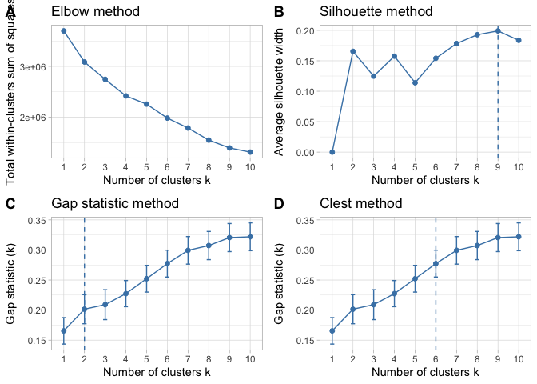
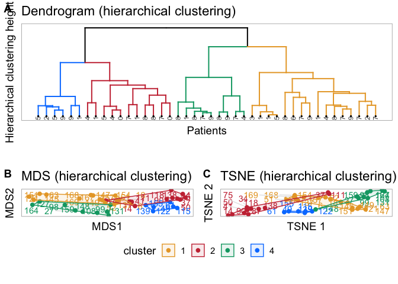

Medication Alignment Algorithm (Medal)
================
Arturo Lopez Pineda
2020-04-06

# Step 0. Load required libraries

``` r
remove(list=ls())

#General
library(tidyverse)
```

    ## ── Attaching packages ────────────────────────────────────────────────────────────────────────── tidyverse 1.3.0 ──

    ## ✓ ggplot2 3.3.0     ✓ purrr   0.3.3
    ## ✓ tibble  3.0.0     ✓ dplyr   0.8.5
    ## ✓ tidyr   1.0.2     ✓ stringr 1.4.0
    ## ✓ readr   1.3.1     ✓ forcats 0.5.0

    ## Warning: package 'tibble' was built under R version 3.6.2

    ## ── Conflicts ───────────────────────────────────────────────────────────────────────────── tidyverse_conflicts() ──
    ## x dplyr::filter() masks stats::filter()
    ## x dplyr::lag()    masks stats::lag()

``` r
library(here)
```

    ## here() starts at /Users/lopezpia/Documents/GitHub/medal

``` r
library(dplyr)
library(knitr)

#Plotting libraries
library(ggplot2)
library(ggpubr)
```

    ## Loading required package: magrittr

    ## 
    ## Attaching package: 'magrittr'

    ## The following object is masked from 'package:purrr':
    ## 
    ##     set_names

    ## The following object is masked from 'package:tidyr':
    ## 
    ##     extract

``` r
library(ggrepel)

#Clustering libraries
library(factoextra)
```

    ## Welcome! Want to learn more? See two factoextra-related books at https://goo.gl/ve3WBa

``` r
library(NbClust)
library(aricode)
library(Rtsne)
library(dendextend)
```

    ## 
    ## ---------------------
    ## Welcome to dendextend version 1.13.4
    ## Type citation('dendextend') for how to cite the package.
    ## 
    ## Type browseVignettes(package = 'dendextend') for the package vignette.
    ## The github page is: https://github.com/talgalili/dendextend/
    ## 
    ## Suggestions and bug-reports can be submitted at: https://github.com/talgalili/dendextend/issues
    ## Or contact: <tal.galili@gmail.com>
    ## 
    ##  To suppress this message use:  suppressPackageStartupMessages(library(dendextend))
    ## ---------------------

    ## 
    ## Attaching package: 'dendextend'

    ## The following object is masked from 'package:ggpubr':
    ## 
    ##     rotate

    ## The following object is masked from 'package:stats':
    ## 
    ##     cutree

``` r
library(NMF) #for cluster purity and entropy
```

    ## Loading required package: pkgmaker

    ## Loading required package: registry

    ## Loading required package: rngtools

    ## Loading required package: cluster

    ## Warning: namespace 'Biobase' is not available and has been replaced
    ## by .GlobalEnv when processing object ''

    ## Warning: namespace 'Biobase' is not available and has been replaced
    ## by .GlobalEnv when processing object ''
    
    ## Warning: namespace 'Biobase' is not available and has been replaced
    ## by .GlobalEnv when processing object ''
    
    ## Warning: namespace 'Biobase' is not available and has been replaced
    ## by .GlobalEnv when processing object ''
    
    ## Warning: namespace 'Biobase' is not available and has been replaced
    ## by .GlobalEnv when processing object ''
    
    ## Warning: namespace 'Biobase' is not available and has been replaced
    ## by .GlobalEnv when processing object ''
    
    ## Warning: namespace 'Biobase' is not available and has been replaced
    ## by .GlobalEnv when processing object ''
    
    ## Warning: namespace 'Biobase' is not available and has been replaced
    ## by .GlobalEnv when processing object ''
    
    ## Warning: namespace 'Biobase' is not available and has been replaced
    ## by .GlobalEnv when processing object ''
    
    ## Warning: namespace 'Biobase' is not available and has been replaced
    ## by .GlobalEnv when processing object ''
    
    ## Warning: namespace 'Biobase' is not available and has been replaced
    ## by .GlobalEnv when processing object ''
    
    ## Warning: namespace 'Biobase' is not available and has been replaced
    ## by .GlobalEnv when processing object ''
    
    ## Warning: namespace 'Biobase' is not available and has been replaced
    ## by .GlobalEnv when processing object ''
    
    ## Warning: namespace 'Biobase' is not available and has been replaced
    ## by .GlobalEnv when processing object ''
    
    ## Warning: namespace 'Biobase' is not available and has been replaced
    ## by .GlobalEnv when processing object ''
    
    ## Warning: namespace 'Biobase' is not available and has been replaced
    ## by .GlobalEnv when processing object ''
    
    ## Warning: namespace 'Biobase' is not available and has been replaced
    ## by .GlobalEnv when processing object ''
    
    ## Warning: namespace 'Biobase' is not available and has been replaced
    ## by .GlobalEnv when processing object ''

    ## NMF - BioConductor layer [NO: missing Biobase] | Shared memory capabilities [NO: bigmemory] | Cores 11/12

    ##   To enable the Bioconductor layer, try: install.extras('
    ## NMF
    ## ') [with Bioconductor repository enabled]
    ##   To enable shared memory capabilities, try: install.extras('
    ## NMF
    ## ')

    ## 
    ## Attaching package: 'NMF'

    ## The following object is masked from 'package:aricode':
    ## 
    ##     entropy

``` r
#Additional functions
#source(here("programs", "fun-medal.R")) #PyMedal is used instead
source(here("programs", "fun-support.R"))
source(here("programs", "fun-plot.R"))
```

 

# Step 1. Read file

``` r
#---
#File with patient ID (de-ID), comorbidities, initial clinical presentation, etc.
patients.og <- read_csv(here("../data", "patients.csv")) %>%
  column_to_rownames(var="id") 
```

    ## Parsed with column specification:
    ## cols(
    ##   .default = col_double(),
    ##   clinical_history = col_logical(),
    ##   Imaging = col_logical(),
    ##   Medication_History = col_logical(),
    ##   HLA_genotyping = col_logical()
    ## )

    ## See spec(...) for full column specifications.

``` r
#Select only a few columns
patients <- patients.og %>%
  select("age_onset", "age_1st_appt", "is_male", "NHW", "OCD", "foodprob", "anx", 
            "emotional", "mood", "agg", "sch", "reg", "sleep", "tics") %>%
  drop_na()

#---
#File with events
events.og <- read_csv(here("../data", "medications.csv")) 
```

    ## Parsed with column specification:
    ## cols(
    ##   id = col_double(),
    ##   age_1st_appt = col_double(),
    ##   age_onset = col_double(),
    ##   medication = col_character(),
    ##   start = col_double(),
    ##   end = col_double(),
    ##   Duration = col_double(),
    ##   firstAppointment = col_double(),
    ##   Frequency = col_character(),
    ##   last_FU = col_double()
    ## )

``` r
#Select only events related to patients in the previous file
events <- events.og %>%
  filter(id %in% rownames(patients)) %>%
  select("id", "medication", "start", "end")

#---
#File with clinical evaluations (outcomes)
outcomes.og <- read_csv(here("../data","outcomes.csv"))
```

    ## Parsed with column specification:
    ## cols(
    ##   .default = col_double()
    ## )
    ## See spec(...) for full column specifications.

``` r
#Select only rows for the same patients listed in Profiles
outcomes <- outcomes.og %>%
  filter(id %in% rownames(patients)) %>%
  select("id", "gi_new", "daysSinceBirth")
```

 

# Step 2. Clean Data and Right Censor

``` r
# Group by class of medication
medgroups <- lst(penicillin = c("penicillin v", "penicillin g", "amoxicillin", "augmentin"),
                cephalosporin = c("cephalexin", "cefadroxil"), 
                macrolide = c("azithromycin"),
                nsaid = c("ibuprofen", "naproxen", "indomethacin", "sulindac", "aspirin"),
                corticosteroid.oral = c("prednisone", "maintenance prednisone", "decadron"),
                corticosteroid.iv = c("solumedrol"),
                immunoglobulins = c("ivig"),
                dmard = c("rituximab", "methotrexate", "cellcept"))

events <- events.og %>%
  cleanEvents(medgroups) %>%
  rightCensoring(2)

write_csv(events, here("../data", "data-matrix-clean.csv"))
```

 

# Step 3. Create a distance matrix

``` r
#-------
#Calling pyMEDAL

pymedal <- here("pymedal", "pymedal.py")
input <- here("../data", "data-matrix-clean.csv")

system(paste('python3', pymedal, input), wait=TRUE)


distMatrix = read.table("distance_mat.txt")
patientIDs = read.table("patientID.txt", sep=",")

pID = as.vector(unlist(patientIDs))
colnames(distMatrix) = pID
rownames(distMatrix) = pID
```

 

# Step 4 Choose number of clusters

``` r
d = distMatrix
k=4

# Elbow method
elbow <- fviz_nbclust(x=d, diss=as.dist(d), hcut, method = "wss") +
  geom_vline(xintercept = k, linetype = "dashed", color="#5581B0", size=0.6) +
  labs(title = "Elbow method",
       y="Total within-clusters sum of squares")

# Silhouette method
silhouette <- fviz_nbclust(x=d, diss=as.dist(d), hcut, method = "silhouette", 
                           print.summary = FALSE, barcolor = "white") +
  #geom_vline(xintercept = 2, linetype = "dashed", color="#5581B0", size=0.6) +
  geom_vline(xintercept = 4, linetype = "dashed", color="#5581B0", size=0.6) +
  labs(title = "Silhouette method")


# Gap statistic
# nboot = 50 to keep the function speedy. 
# recommended value: nboot= 500 for your analysis.
# Use verbose = FALSE to hide computing progression.
set.seed(123)
gapStat <- fviz_nbclust(x=d, diss=as.dist(d), hcut, nstart = 25, 
                        method = "gap_stat", nboot = 50, print.summary = FALSE,
                        maxSE=list(method="Tibs2001SEmax", SE.factor=1)) +
  labs(title = "Gap statistic method")

gpanels <- ggarrange(elbow, silhouette, gapStat,
                     labels = c("A", "B", "C"),
                     ncol = 3, nrow = 1, legend="bottom", 
                     align="v", common.legend = FALSE)
ggexport(gpanels, filename=here("images", "Figure1-num-clusters.png"), height = 1200, width = 4000, res=300)
```

    ## file saved to /Users/lopezpia/Documents/GitHub/medal/images/Figure1-num-clusters.png

``` r
gpanels
```

<!-- -->

 

# Step 5. Plot clusters

``` r
#Colors to be used
color.vector = c("1"="#e8a631", "2"="#ca3542", "3"="#00a572", "4"="#0080ff")
#color.vector3 = c("1"="mediumorchid3", "2"="darkturquoise", "3"="olivedrab3", "4"="orangered3")

#Plot Clustering strategies
dend = getDendrogram(d, k, color.vector)
gDend <- plotDendrogram(dend, k)
gMDSclus12 <- plotMDS(d, as.character(cutree(dend, k)), color.vector, 1, 2, "MDS (hierarchical clustering)")
```

    ## initial  value 18.914825 
    ## final  value 18.914116 
    ## converged

``` r
gMDSclus34 <- plotMDS(d, as.character(cutree(dend, k)), color.vector, 3, 4, "MDS (hierarchical clustering)")
```

    ## initial  value 18.914825 
    ## final  value 18.914116 
    ## converged

``` r
kmeans = getKMeansClusteringPCA(d, k)
gMDSkmeans12 <- plotMDS(d, kmeans$cluster, color.vector, 1, 2, "MDS (k-means)")
```

    ## initial  value 18.914825 
    ## final  value 18.914116 
    ## converged

``` r
gMDSkmeans34 <- plotMDS(d, kmeans$cluster, color.vector, 3, 4, "MDS (k-means)")
```

    ## initial  value 18.914825 
    ## final  value 18.914116 
    ## converged

``` r
tsne1 = getHierarchicalClusteringTSNE(d, k, perplexity = 4)
gTSNEclus <- plotTSNE(tsne1, color.vector, "TSNE (hierarchical clustering)")
 
tsne2 = getKMeansClusteringTSNE(d, k, perplexity = 4)
gTSNEkmeans <- plotTSNE(tsne2, color.vector, "TSNE (k-means)")


# Combine plots and save
gpanels <- ggarrange(gDend, 
                     ggarrange(gMDSclus12, gTSNEclus,
                               labels = c("B", "C"),
                               align = "hv",
                               legend="bottom", common.legend = TRUE),
                     ncol = 1, nrow=2, 
                     labels = c("A"),
                     align = "h",
                     legend="bottom", common.legend = TRUE)
ggexport(gpanels, filename=here("images", "Figure2-dendro-mds.png"), height = 4000, width = 4000, res=300)
```

    ## file saved to /Users/lopezpia/Documents/GitHub/medal/images/Figure2-dendro-mds.png

``` r
gpanels
```

<!-- -->

 

# Step 6. Comparison to K-means

``` r
res <- tibble(k=c(2,4))

#Assume a k=2, then merge sub-clusters
recoded = kmeans$cluster
recoded[which(recoded == 3)] = 1
recoded[which(recoded == 4)] = 2

#Calculating Normalized Mutual Information
#https://course.ccs.neu.edu/cs6140sp15/7_locality_cluster/Assignment-6/NMI.pdf
res <- res %>%
  bind_cols(
    NMI = c(round(NMI(recoded, cutree(dend,2), variant="sum"), digits=2),
          round(NMI(kmeans$cluster, cutree(dend,4), variant="sum"), digits=2)))
  

#Calculating Cluster purity
#https://www.rdocumentation.org/packages/NMF/versions/0.21.0/topics/purity
res <- res %>%
  bind_cols(
    Purity = c(round(purity(recoded, cutree(dend,2)), digits=2),
            round(purity(kmeans$cluster, cutree(dend,4)), digits=2)))


#Calculating Cluster entropy
#https://www.rdocumentation.org/packages/NMF/versions/0.21.0/topics/purity
res <- res %>%
  bind_cols(
    Entropy = c(round(entropy(recoded, cutree(dend,2)), digits=2),
             round(entropy(kmeans$cluster, cutree(dend,4)), digits=2)))

res %>%
  kable()
```

| k |  NMI | Purity | Entropy |
| -: | ---: | -----: | ------: |
| 2 | 0.16 |   0.71 |    0.81 |
| 4 | 0.37 |   0.60 |    0.60 |

 

# Step 7. Save cluster assignment

``` r
#Saving the cluster to profiles
assignment <- cutree(dend,k)
#index = which(profiles$id %in% names(assignment))
#write.csv(cbind(profiles[index,], cluster=assignment),
#          "../data/data-matrix-profiles-cluster.csv")
```
